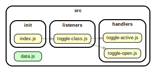

<!-- BEGIN TITLE -->

# DOCS

<!-- END TITLE -->

<!-- BEGIN TREE -->

<!-- END TREE -->

<!-- BEGIN TOC -->

- handlers
  - [toggle-active.js](#srchandlerstoggle-activejs)
  - [toggle-open.js](#srchandlerstoggle-openjs)
- init
  - [index.js](#srcinitindexjs)
- listeners
  - [toggle-class.js](#srclistenerstoggle-classjs)
- logic
- procedures
- [data.js](#srcdatajs)

<!-- END TOC -->

<!-- BEGIN DOCS -->

---

# /handlers

<a href="../src/handlers/toggle-active.js" id="srchandlerstoggle-activejs">src/handlers/toggle-active.js</a>

## toggleActive

| Param | Type               | Description                                          |
| ----- | ------------------ | ---------------------------------------------------- |
| e     | <code>Event</code> | The event triggered when the user clicks the button. |

<a href="../src/handlers/toggle-open.js" id="srchandlerstoggle-openjs">src/handlers/toggle-open.js</a>

## toggleOpen

| Param | Type               | Description                                          |
| ----- | ------------------ | ---------------------------------------------------- |
| e     | <code>Event</code> | The event triggered when the user clicks the button. |

---

[TOP](#DOCS)

---

# /init

<a href="../src/init/index.js" id="srcinitindexjs">src/init/index.js</a>

---

[TOP](#DOCS)

---

# /listeners

<a href="../src/listeners/toggle-class.js" id="srclistenerstoggle-classjs">src/listeners/toggle-class.js</a>

---

[TOP](#DOCS)

---

# /logic

---

[TOP](#DOCS)

---

# /procedures

---

[TOP](#DOCS)

<a href="../src/data.js" id="srcdatajs">src/data.js</a>

<!-- END DOCS -->
